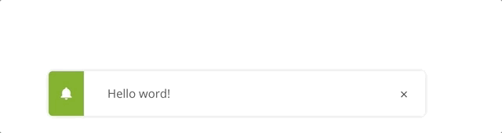

# YodaVueToaster

[](https://www.npmjs.com/package/yoda-vuetoaster) [](https://vuejs.org/)

> A Vue.js Plugin for toaster

## Installation

```bash
npm install --save yoda-vuetoaster
```

## Usage

### Bundler (Webpack, Rollup)

```js
import Vue from 'vue'
import VueToaster from 'yoda-vuetoaster'
// You need a specific loader for CSS files like https://github.com/webpack/css-loader
import 'yoda-vuetoaster/dist/yoda-vuetoaster.css'

Vue.use(VueToaster)
```

### Example

```html
<yoda-vuetoaster
  type="success"
  content="Toaster Message"
  autoClose="true"
  autoCloseTime="2000"
></yoda-vuetoaster>
```



### Props config

```js
autoClose: {
  type: Boolean,
  default: true
},
autoCloseTime: {
  type: Number,
  default: 3000
},
showToaster: {
  type: Boolean,
  default: false
},
content: {
  type: String,
  default: 'Message'
},
types: {
  type: String,
  default: 'success' // success or error
}

```


### Browser

```html
<!-- Include after Vue -->
<!-- Local files -->
<link rel="stylesheet" href="yoda-vuetoaster/dist/yoda-vuetoaster.css"></link>
<script src="yoda-vuetoaster/dist/yoda-vuetoaster.js"></script>

<!-- From CDN -->
<link rel="stylesheet" href="https://unpkg.com/yoda-vuetoaster/dist/yoda-vuetoaster.css"></link>
<script src="https://unpkg.com/yoda-vuetoaster"></script>
```

## Development

### Launch visual tests

```bash
npm run dev
```

### Launch Karma with coverage

```bash
npm run dev:coverage
```

### Build

Bundle the js and css of to the `dist` folder:

```bash
npm run build
```


## Publishing

The `prepublish` hook will ensure dist files are created before publishing. This
way you don't need to commit them in your repository.

```bash
# Bump the version first
# It'll also commit it and create a tag
npm version
# Push the bumped package and tags
git push --follow-tags
# Ship it 🚀
npm publish
```

## License

[MIT](http://opensource.org/licenses/MIT)
