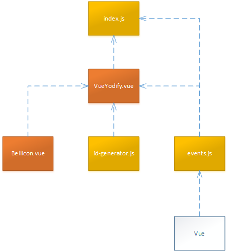

# vue-yodify by <a href="https://www.3yourmind.com/">3YOURMIND</a>

## Description

> A simple Vue.js plugin to enable notifications with ease.

## Dependencies

| Name | Version |                                            Information                                             |
| ---- | ------- | -------------------------------------------------------------------------------------------------- |
| vue  | ^2.5.8  |   |

## Installation

### Using yarn

```shell
yarn add @3yourmind/vue-yodify
```

### Using npm

```shell
npm install @3yourmind/vue-yodify
```

## How to use

You need to register this library as a plugin. So you need to find the file where you are registering Vue.js. In the most common case this will be the file `src/main.js`. Inside this file you need to import this library and bind it to Vue.js.

```javascript
import Vue from 'vue';
import VueYodify from '@3yourmind/vue-yodify';

Vue.use(VueYodify);
```

Then you need to register a global component in your app so the library can find the component somehow. To do this go to your root component and extend it by using the component once.

```html
<template>
  <div id="app">
    <VueYodify />
    <router-view />
  </div>
</template>

<script>
export default {
  name: 'app',
};
</script>
```

After registering the component you can call it globally by using the Vue instance in the script part of a component.

```js
this.$yodify({
  text: 'This was successful :)',
  type: 'success'
});
```

## Architecture

Before getting into architecture, you should make sure to understand the Vue.js plugin system which is documented [here](https://vuejs.org/v2/guide/plugins.html).

<span>
  
</span>

## Contributors

<table><thead><tr><th align="center"><a href="https://github.com/igeligel"><br><sub>igeligel</sub></a><br><p>Contributions: 11</p></th><th align="center"><a href="https://github.com/ostoc"><br><sub>ostoc</sub></a><br><p>Contributions: 4</p></th></tbody></table>

## License

*vue-yodify* is realeased under the [MIT License](./LICENSE.md).
